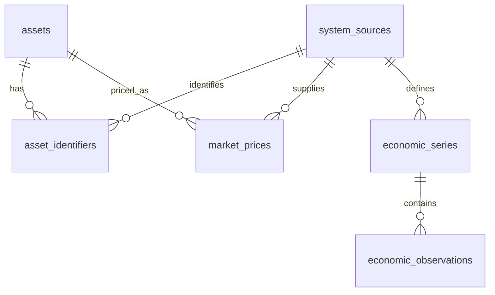

# M1-A Data Schema Design

## 1. Scope

M1-A defines the smallest Supabase PostgreSQL data-foundation schema required for the M1 asset, source, daily market-price, and macro-data pipelines. It is a design only: it creates no SQL, migration, database object, API, UI, agent, or seed data.

Included candidates are `assets`, `asset_identifiers`, `system_sources`, `market_prices`, `economic_series`, and `economic_observations`. News, research, signals, agents, predictions, portfolios, trading, RLS implementation, and ingestion-run logging are out of scope.

## 2. Schema Overview



`asset_identifiers` is retained as a separate table. It prevents provider-specific symbols from becoming relationship keys or being overloaded into `assets.symbol`. No additional M1 table is proposed: raw archival policy and ingestion execution history are implementation decisions/future considerations, not schema requirements for this milestone.

## 3. Table Design

### 3.1 `system_sources`

Purpose: provider registry, source governance, and provider-independent foreign-key anchor. It is separate from assets because one provider supplies many assets and a single asset can have identifiers and prices from multiple providers.

| Column | PostgreSQL type | Nullable | Default | Constraint | Description |
| --- | --- | --- | --- | --- | --- |
| id | uuid | No | generated UUID | PK | Internal source ID |
| code | text | No | — | UNIQUE | Stable application code, e.g. `FRED` |
| name | text | No | — | — | Display name |
| source_type | text | No | — | CHECK controlled vocabulary | Provider / exchange / central bank classification |
| category | text | Yes | — | — | Market, macro, or mixed |
| country | text | Yes | — | — | ISO country code where applicable |
| tier | text | No | `S` | CHECK `S`–`D` | M0 evidence tier |
| priority | smallint | No | `100` | CHECK >= 0 | Lower operational preference rank is preferred |
| reliability | smallint | Yes | — | CHECK 0–100 | Configurable source-quality assessment |
| base_url | text | Yes | — | — | Public base URL, never a secret |
| credential_env_key | text | Yes | — | — | Environment/secret reference only, never a credential value |
| enabled | boolean | No | true | — | Operational enablement flag |
| metadata | jsonb | No | `'{}'` | — | Provider-specific non-secret metadata |
| created_at | timestamptz | No | current UTC time | — | Row creation time |
| updated_at | timestamptz | No | current UTC time | — | Last row update time |

### 3.2 `assets`

Purpose: stable internal asset master. It is necessary for the M1 universe and remains independent of a market-data provider.

| Column | PostgreSQL type | Nullable | Default | Constraint | Description |
| --- | --- | --- | --- | --- | --- |
| id | uuid | No | generated UUID | PK | Internal `asset_id` |
| symbol | text | Yes | — | — | Canonical human-facing symbol only; not a relationship key or global unique key |
| name | text | No | — | — | Canonical asset name |
| asset_type | text | No | — | CHECK | `STOCK`, `ETF`, `INDEX`, `BOND`, `FX`, `COMMODITY`, or `CRYPTO` |
| exchange | text | Yes | — | — | Canonical venue/market label where relevant |
| country | text | Yes | — | — | ISO country code where applicable |
| currency | char(3) | Yes | — | — | ISO 4217 quote/base currency where applicable |
| timezone | text | Yes | — | — | IANA market timezone, e.g. `America/New_York` |
| is_active | boolean | No | true | — | Soft lifecycle state |
| created_at | timestamptz | No | current UTC time | — | Row creation time |
| updated_at | timestamptz | No | current UTC time | — | Last row update time |

No global `(symbol)` unique constraint is recommended because symbols collide across exchanges, markets, and providers. A future application-level canonical-asset uniqueness rule can be considered after the asset namespace is finalized; M1's small approved universe does not justify a premature composite rule.

### 3.3 `asset_identifiers`

Purpose: maps one `asset_id` to the identifiers used by a source. It is required because, for example, Samsung Electronics may be `005930`, `005930.KS`, or `KRX:005930` depending on the source.

| Column | PostgreSQL type | Nullable | Default | Constraint | Description |
| --- | --- | --- | --- | --- | --- |
| id | uuid | No | generated UUID | PK | Identifier-row ID |
| asset_id | uuid | No | — | FK → `assets.id` | Internal asset relation |
| source_id | uuid | No | — | FK → `system_sources.id` | Identifier namespace owner |
| identifier_type | text | No | — | — | Symbol, provider ID, ISIN, etc. |
| identifier_value | text | No | — | — | Source-defined identifier |
| metadata | jsonb | No | `'{}'` | — | Provider-specific attributes |
| is_active | boolean | No | true | — | Identifier lifecycle state |
| created_at | timestamptz | No | current UTC time | — | Row creation time |
| updated_at | timestamptz | No | current UTC time | — | Last row update time |

### 3.4 `market_prices`

Purpose: normalized daily OHLCV observations. It remains separate from `assets` because it is time series, and from sources because the same asset can be supplied by several providers.

| Column | PostgreSQL type | Nullable | Default | Constraint | Description |
| --- | --- | --- | --- | --- | --- |
| id | bigint | No | identity | PK | Narrow time-series surrogate key |
| asset_id | uuid | No | — | FK → `assets.id` | Asset relation |
| source_id | uuid | No | — | FK → `system_sources.id` | Supplying provider |
| interval | text | No | `1d` | CHECK supported values | `1d` in M1; extensible later |
| market_time | timestamptz | No | — | — | UTC instant for market observation/bar close |
| open | numeric(20,8) | Yes | — | CHECK >= 0 | Opening price if supplied |
| high | numeric(20,8) | Yes | — | CHECK >= 0 | High price if supplied |
| low | numeric(20,8) | Yes | — | CHECK >= 0 | Low price if supplied |
| close | numeric(20,8) | Yes | — | CHECK >= 0 | Closing/last price if supplied |
| adjusted_close | numeric(20,8) | Yes | — | CHECK >= 0 | Adjusted close if supplied |
| volume | numeric(24,0) | Yes | — | CHECK >= 0 | Volume if meaningful and supplied |
| currency | char(3) | Yes | — | — | Provider quote currency when supplied |
| retrieved_at | timestamptz | No | current UTC time | — | System collection time |
| created_at | timestamptz | No | current UTC time | — | First persistence time |
| updated_at | timestamptz | No | current UTC time | — | Last correction/update time |

Prices may legitimately omit volume, an OHLC component, or adjusted close for some asset/provider combinations. At least one price field among `open`, `high`, `low`, `close`, and `adjusted_close` must be present; this is a row-validity CHECK for M1-B. `market_time` is stored in UTC; the source market's IANA timezone belongs on the associated asset and must remain available for display and calendar interpretation.

### 3.5 `economic_series`

Purpose: provider-specific definition of one economic series. It is separated from observations because definitions change infrequently and observations/revisions are time series.

| Column | PostgreSQL type | Nullable | Default | Constraint | Description |
| --- | --- | --- | --- | --- | --- |
| id | uuid | No | generated UUID | PK | Internal series ID |
| source_id | uuid | No | — | FK → `system_sources.id` | FRED, ECOS, or other source |
| source_series_id | text | No | — | — | Provider series/statistic ID |
| name | text | No | — | — | Series display name |
| country | text | Yes | — | — | ISO country code where applicable |
| frequency | text | No | — | — | Daily, monthly, quarterly, etc. |
| unit | text | Yes | — | — | Provider-defined unit |
| seasonal_adjustment | text | Yes | — | — | Provider-defined adjustment status |
| description | text | Yes | — | — | Series description |
| is_active | boolean | No | true | — | Lifecycle state |
| metadata | jsonb | No | `'{}'` | — | Provider-specific definition metadata |
| created_at | timestamptz | No | current UTC time | — | Row creation time |
| updated_at | timestamptz | No | current UTC time | — | Last row update time |

### 3.6 `economic_observations`

Purpose: normalized economic values with immutable vintage history. It is required to reconstruct the information set available at a prior analysis time and avoid look-ahead bias.

| Column | PostgreSQL type | Nullable | Default | Constraint | Description |
| --- | --- | --- | --- | --- | --- |
| id | bigint | No | identity | PK | Narrow time-series surrogate key |
| series_id | uuid | No | — | FK → `economic_series.id` | Series relation |
| observation_date | date | No | — | — | Economic period/date observed |
| value | numeric(24,10) | Yes | — | — | Reported numeric value; nullable only for provider missing values |
| value_text | text | Yes | — | — | Original non-numeric/missing marker if needed |
| vintage_at | timestamptz | No | — | — | Earliest known publication/vintage instant of this value |
| source_published_at | timestamptz | Yes | — | — | Provider publication timestamp when supplied |
| data_as_of_time | timestamptz | Yes | — | — | Provider-declared validity/as-of time when distinct |
| retrieved_at | timestamptz | No | current UTC time | — | System acquisition time |
| revision_label | text | Yes | — | — | Provider revision/vintage label when available |
| metadata | jsonb | No | `'{}'` | — | Provider-specific revision context |
| created_at | timestamptz | No | current UTC time | — | First persistence time |

`value` and `value_text` are mutually informative: a numeric observation stores `value`; a provider missing/non-numeric marker may use `value_text`. This avoids converting provider meaning into a numeric zero.

## 4. Relationships

| Child | Parent | FK | ON DELETE | Rationale |
| --- | --- | --- | --- | --- |
| asset_identifiers | assets | asset_id | RESTRICT | Do not delete an asset with active identity history |
| asset_identifiers | system_sources | source_id | RESTRICT | Preserve identifier namespace provenance |
| market_prices | assets | asset_id | RESTRICT | Preserve historical price linkage |
| market_prices | system_sources | source_id | RESTRICT | Preserve provider provenance |
| economic_series | system_sources | source_id | RESTRICT | Preserve series definition provenance |
| economic_observations | economic_series | series_id | RESTRICT | Preserve published/revised history |

Assets, sources, and series use lifecycle flags (`is_active` / `enabled`) rather than application-level hard deletion. Historical prices and observations have no normal-user hard-delete path.

## 5. Unique Constraints

| Table | Constraint | Policy |
| --- | --- | --- |
| system_sources | `code` | One internal source code per provider |
| asset_identifiers | `(source_id, identifier_type, identifier_value)` | An identifier belongs to at most one internal asset inside its provider namespace |
| economic_series | `(source_id, source_series_id)` | One normalized definition per provider series |
| market_prices | `(asset_id, source_id, interval, market_time)` | One current normalized bar per asset/provider/interval/instant |
| economic_observations | `(series_id, observation_date, vintage_at)` | Preserve every known value vintage; never overwrite an older vintage |

The `market_prices` unique key is deliberately separate from economic observations: market-price corrections are handled as a current-bar correction in M1, whereas macro revisions retain vintage history.

## 6. Indexes

Only the following M1 query-driven indexes are recommended in addition to primary keys and unique indexes:

| Table | Index | Query supported |
| --- | --- | --- |
| market_prices | `(asset_id, market_time DESC)` | Asset price history and latest daily price |
| market_prices | `(source_id, market_time DESC)` | Source-specific ingestion/review |
| economic_observations | `(series_id, observation_date DESC, vintage_at DESC)` | Series history and latest vintage by observation date |
| economic_observations | `(series_id, vintage_at DESC)` | Information-set reconstruction as of a prior time |
| asset_identifiers | `(source_id, identifier_value)` | Provider identifier resolution |

The source/identifier unique index already starts with `source_id`; the additional identifier index is retained only if `identifier_type` is not always known on lookup. M1-B should omit it if the actual lookup always includes type.

## 7. Asset Identity Strategy

`assets.id` is the only internal market relationship key. `assets.symbol` is a canonical convenience/display value, not a join key. `asset_identifiers` stores each source's identifier namespace, preserving provider changes and enabling multiple providers without remapping historical prices. This directly answers Q1: the table is necessary and its namespace uniqueness is `(source_id, identifier_type, identifier_value)`.

## 8. Market Price Strategy

M1 stores daily (`1d`) normalized bars and permits future interval values without implementing real-time ingestion. `market_prices` uses a `bigint` identity primary key plus the natural unique key `(asset_id, source_id, interval, market_time)`.

This is preferred to a UUID PK for a potentially high-volume time series (smaller index/storage footprint) and to a composite PK (simpler foreign references and operational tooling). The natural unique key remains the duplicate guard.

On re-ingestion of the same bar, M1-B uses an idempotent upsert keyed by that unique constraint: unchanged values do not create a row; corrected values update normalized fields, `retrieved_at`, and `updated_at`. Provider price corrections are therefore represented as the current best normalized bar, not a separate market-price vintage table. Raw archival, if selected, retains original responses for audit. This is intentionally different from economic data because M1's daily price pipeline does not require historical provider-correction backtests.

## 9. Economic Revision / Vintage Strategy

Use provider-independent Option C: immutable normalized snapshots with `vintage_at`, combined with provider revision fields (`source_published_at`, `revision_label`, and `metadata`) where available. `vintage_at` is the earliest reliable instant the system can establish for that value: use provider publication/vintage time when supplied; otherwise use the retrieval time. It is not a revision sequence number and therefore works across FRED and ECOS.

Every changed value for the same `(series_id, observation_date)` is inserted with a new `vintage_at`; no prior row is updated. The latest known value is the row with the greatest `vintage_at`. To reconstruct the data available at time T, select observations whose `vintage_at <= T`, then choose the latest vintage per series and observation date. This prevents later revisions from appearing in a historical prediction/backtest input set (Q5 and Q6).

## 10. Time Semantics

All database timestamp values use `timestamptz` and are standardized to UTC. UI display defaults to `Asia/Seoul`; market-local metadata remains on `assets.timezone`.

| Time | Applies to | Meaning |
| --- | --- | --- |
| analysis_time | Future agent/prediction records only | When an analysis actually ran; not stored in M1-A tables |
| data_as_of_time | economic_observations when provided | Provider validity/reference time for the data |
| source_published_at | economic_observations when provided | When the original provider published a release/revision |
| retrieved_at | market_prices, economic_observations | When this system collected the data |
| market_time | market_prices | UTC instant of the market bar/observation |
| vintage_at | economic_observations | Earliest known availability of this specific value vintage |
| created_at / updated_at | mutable master/current tables | Persistence and modification audit times |

The timestamps are not interchangeable. `analysis_time` is intentionally absent from M1-A, because M1 contains no analysis output.

## 11. Numeric Type Strategy

Use exact `numeric`, not `double precision`, for financial prices and economic values: `numeric(20,8)` for market prices, `numeric(24,0)` for volume, and `numeric(24,10)` for economic values. This avoids binary floating-point drift and supports differing source precisions. `smallint` is appropriate for bounded priority/reliability values. Application JavaScript must treat these numerics as decimal strings or a decimal-safe representation rather than assuming native `number` is exact.

## 12. Raw / Normalized Strategy

The logical pipeline remains:

```text
External Provider → Raw Source Data → Normalized Data → Calculation → Signal
```

The six M1-A tables contain normalized master and time-series data, not raw payloads. During M1 provider design, each provider chooses one of: database raw retention, separate storage/archive retention, or normalized-only retention with source ID and lineage. Whatever option is chosen, source identity, provider identifier/series ID, retrieval time, and normalization version/context must remain traceable. No raw-payload table is proposed now because M1-A must not preselect a storage mechanism.

## 13. M1-B Migration Plan

Recommended implementation order, without SQL in this document:

1. Confirm required PostgreSQL extension and controlled-vocabulary strategy.
2. Create `system_sources`.
3. Create `assets`.
4. Create `asset_identifiers` and its foreign keys/unique key.
5. Create `market_prices` with its natural unique key and validation checks.
6. Create `economic_series`.
7. Create `economic_observations` with immutable-vintage unique key.
8. Add the minimum query indexes.
9. Define static source/asset/series seed strategy separately from secrets.
10. Validate duplicate handling, correction behavior, revision history, UTC conversion, and as-of reconstruction with static fixtures.

## 14. Open Decisions

- Select market-data provider(s), their source codes, and correction semantics before M1-B.
- Confirm the exact M1 `source_type`, `category`, and `interval` controlled vocabularies (CHECK versus PostgreSQL enum); do not over-create enums before actual values stabilize.
- Confirm canonical asset namespace/display-symbol policy and supported exchange/country code standards.
- Verify FRED Series IDs and ECOS statistic/item codes before seeding; do not guess them here.
- Set exact price/economic precision only after reviewing selected provider payloads.
- Choose raw-response retention location per provider and required lineage metadata.
- Confirm whether provider timestamps are sufficiently trustworthy for `vintage_at`; otherwise document the retrieval-time fallback.
- Define M1-B access/RLS model separately; do not introduce tenant schema preemptively.

## 15. Future Considerations

`ingestion_runs` may later record failures, row counts, and payload lineage, but is not an M1-A table. M2+ may add signals, agent outputs, predictions, news, research, portfolios, realtime data, and revision-aware market-price history only when their approved requirements justify them.

## Design Answers

| Question | Decision |
| --- | --- |
| Q1 | `asset_identifiers` is required; unique by source, type, and value. |
| Q2 | `market_prices` uses identity `bigint` PK plus natural unique key. |
| Q3 | Re-ingestion uses idempotent upsert on the natural unique key. |
| Q4 | Price corrections update the current normalized bar; optional raw retention preserves audit material. |
| Q5 | Economic observations are immutable rows keyed by series, observation date, and vintage. |
| Q6 | Yes; select vintages available at or before the historical cutoff. |
| Q7 | Common series/observation model with provider IDs and metadata absorbs FRED/ECOS differences. |
| Q8 | Timestamps are assigned only where their semantics apply; see Time Semantics. |
| Q9 | Exact numeric types store price/value/volume; bounded integers store rankings. |
| Q10 | Asset history, series/vintage, and provider-identifier lookup indexes only. |
